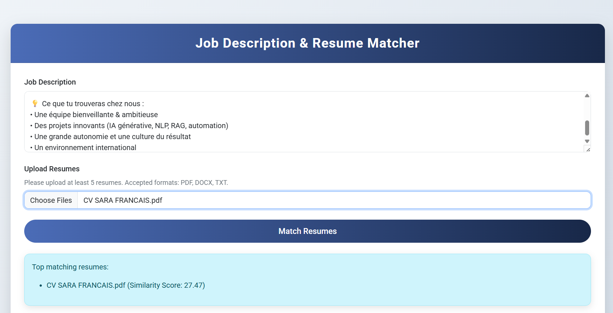

# 🚀 Smart Job Description & Resume Matching System with Python & AI




Welcome to **MATCH_RESUME**

This project automates the recruitment process by intelligently comparing job descriptions with candidate resumes, giving recruiters a **fast, accurate, and data-driven way to identify the best-fit candidates**.  

Say goodbye to manual resume screening and hello to **AI-powered recruitment**! ✨

---

## 🌟 Key Features

- **Intelligent Job Description Input**  
  Recruiters can seamlessly input job descriptions into the system, ready to be matched with candidate profiles.

- **Flexible Resume Upload**  
  Candidates can upload resumes in multiple formats (PDF, DOCX, TXT), and the system will extract and process the text automatically.

- **AI-Powered Matching Algorithm**  
  Utilizes **TF-IDF vectorization** and **cosine similarity** to compute similarity scores between job descriptions and resumes, ranking candidates by relevance.

- **Dynamic Result Presentation**  
  Matched resumes are displayed with **similarity percentages** and personalized feedback, helping recruiters make **data-driven hiring decisions** quickly.

- **Automated Candidate Feedback**  
  Provides candidates with insights into how closely their resume aligns with the job description, encouraging improvement and transparency.

---

## 🛠️ Technologies & Tools

- **Python** – Backend logic and machine learning implementation.  
- **Flask** – Lightweight web framework for handling server requests and responses.  
- **Bootstrap** – Responsive and clean frontend design for an intuitive user experience.  
- **Machine Learning Libraries** – `scikit-learn` for TF-IDF vectorization, cosine similarity, and AI-driven text matching.  
- **HTML / CSS** – Clean, user-friendly interface for recruiters and candidates.  

---

## ⚡ Why This Project is Unique

- Fully automated **AI-driven resume screening**  
- Provides **percent-based similarity scores** with actionable feedback  
- Supports **multi-format resume processing**  
- **Streamlines hiring workflows** for faster, smarter recruitment decisions  

---

## 📈 How It Works

1. **Input Job Description:** Recruiters enter a job description in the web interface.  
2. **Upload Resumes:** Candidates submit their resumes in supported formats.  
3. **Text Extraction & Processing:** PDFs, DOCX, and TXT files are converted to plain text and cleaned.  
4. **Similarity Calculation:** The system uses TF-IDF and cosine similarity to rank resumes.  
5. **Results & Feedback:** Top matches are shown with similarity scores and personalized feedback for candidates.

---

## 🚀 Future Improvements

- Add **advanced NLP techniques** like BERT for semantic matching  
- Implement **dashboard analytics** for recruiters  
- Include **real-time notifications** for high-matching candidates  
- Support **multi-language resume processing**  

---

## 📌 Usage

1. Clone this repository:  
```bash
git clone https://github.com/sarahammoudaa/MATCH_RESUME.git
